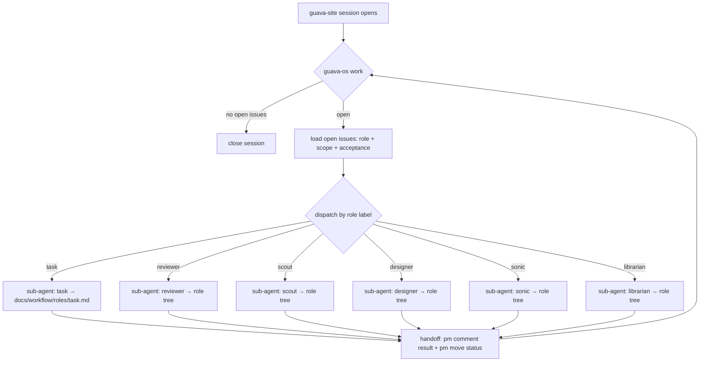

# guava-site — governed by guava-os

guava-site is a registered guava-os consumer. A session here is a
**dispatcher**, not an implementer: it loads guava-site's open Linear issues
and delegates each to an OMP role subagent. Planning happened upstream in
guava-os.

Roles (the 6 OMP agent types): `task`, `reviewer`, `scout`, `designer`,
`sonic`, `librarian`.

## On session open

A hook runs `guava-os work` (this project). No open issues → the session
closes.

## Dispatch loop



## Tooling

Only guava-os tooling; never Linear MCP directly. The binary lives in the
guava-os checkout:

```bash
~/dev/guava-os/.guava-os/bin/guava-os pm <cmd>
```

Run it from THIS repo root so it loads guava-site's `.guava-os/config.json`.
Role decision trees: `~/dev/guava-os/docs/workflow/roles/`.
