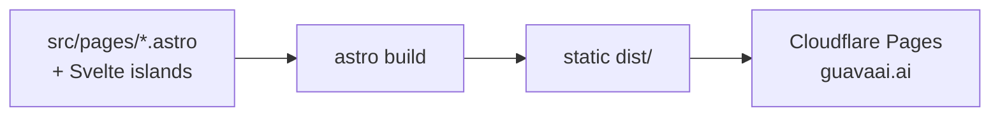

# Guava AI

Marketing site for Guava AI — the company site at guavaai.ai.

## Architecture

A static site built with Astro, Svelte component islands, Tailwind CSS, and
GSAP. `astro build` emits pure static HTML/CSS/JS; there is no server adapter,
database, or API. The site deploys to Cloudflare Pages via
`wrangler pages deploy` (project `company-site`).

## Status

- **State:** active — maintained as the public company presence.
- **Deployed:** live at https://guavaai.ai (Cloudflare Pages).
- **Run:** `npm run dev` (local); `npm run deploy` (build + publish).

## Disclosure

This is a frontend-only marketing site: static HTML with client-side Svelte
islands for interactivity and GSAP for motion. It has no backend, no database,
and no authentication.

The waitlist, newsletter, and contact forms are client-side only and currently
**post nowhere** — the subscriber endpoint is unresolved in the codebase, so
forms show a confirmation but do not send or store any submission. Nothing in
the source should be read as claiming otherwise.