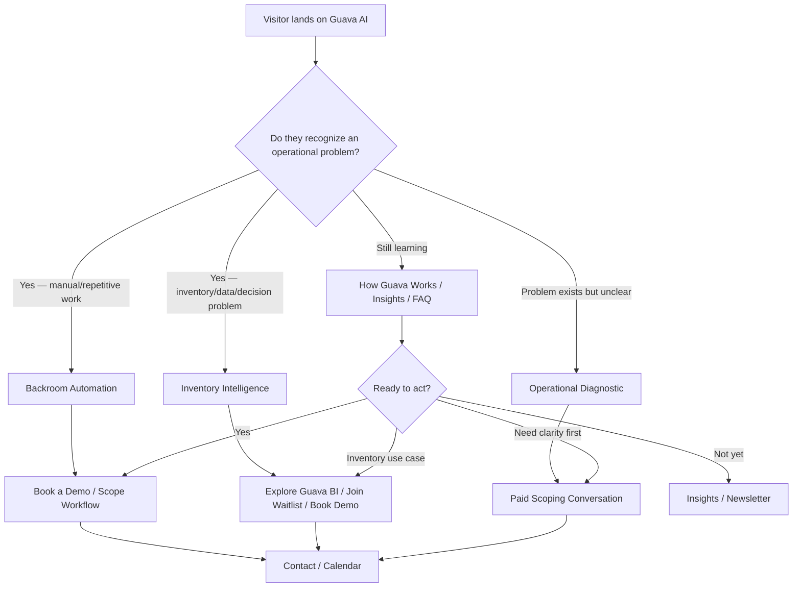

# Guava AI — Website Flow / Homepage Structure

```mermaid
flowchart TD

    A["HOME<br/><br/>Guava AI<br/>Technology for businesses that have outgrown how they operate<br/><br/>Nav:<br/>Solutions ▾ | Industries ▾ | About | Insights | Contact<br/><br/>Primary CTA: Book a Demo"]

    A --> B["HERO<br/><br/>Your business has outgrown the way it operates.<br/><br/>Guava builds practical systems that reduce manual work,<br/>improve visibility, and help your operation scale without multiplying complexity.<br/><br/>CTA: Book a Demo"]

    B --> C["HOW GUAVA WORKS<br/><br/>Operational systems that grow with you.<br/><br/>Connect data → understand workflows → remove friction → build reliable systems → measure results<br/><br/>CTA Banner: Book a Demo"]

    C --> D["PLATFORM / CAPABILITY EXPERIENCE<br/><br/>Left-side selectable list + large corresponding visual<br/><br/>1. Pipelines<br/>2. Dashboards<br/>3. Chat<br/>4. Pulse<br/>5. Spotlight<br/><br/>Each item changes the large visual on the right."]

    D --> E["WHAT GUAVA SOLVES<br/><br/>Second selectable list + large corresponding visual<br/><br/>1. Backroom Automation<br/>2. Operational Diagnostic<br/>3. Dashboards & Decision Support<br/>4. Real-Time Reporting<br/>5. Pipeline Unification<br/>6. Custom Operational Systems<br/><br/>CTA Banner: Talk About Your Operation"]

    E --> F["CURRENT WEDGES<br/><br/>Backroom Automation<br/>Reduce recurring operational work people should not need to do manually.<br/><br/>Inventory Intelligence / Guava BI<br/>Turn inventory data into trusted visibility, signals, and recommendations.<br/><br/>CTAs:<br/>Explore Backroom Automation<br/>Explore Inventory Intelligence"]

    F --> G["INDUSTRY / USE-CASE ROUTING<br/><br/>Inventory-driven businesses<br/>Retail<br/>Distribution<br/>Wholesale<br/>Pharmacy<br/>Multi-location operations<br/><br/>CTA: See How Guava Fits Your Operation"]

    G --> H["PROOF / OPERATING PRINCIPLES<br/><br/>Technology should serve the business — not the other way around.<br/><br/>Outcome themes:<br/>Less manual work<br/>Better visibility<br/>More reliable systems<br/>Faster decisions<br/>Greater operating capacity"]

    H --> I["LATEST INSIGHTS<br/><br/>3 cards across page width<br/><br/>Newsletter / Insight 1<br/>Newsletter / Insight 2<br/>Newsletter / Insight 3<br/><br/>CTA: View All Insights"]

    I --> J["FAQ<br/><br/>Questions focused on operational technology,<br/>AI, automation, data, implementation, and ROI"]

    J --> K["FINAL CTA<br/><br/>Your systems should make the business easier to run.<br/><br/>CTA: Book a Demo<br/>Secondary: Contact Guava"]

    K --> L["FOOTER<br/><br/>Solutions | Industries | Company | Insights | Legal | Contact"]
```

---

# Page Structure

## 1. Header

**Logo:** Guava AI

**Navigation**

* Solutions ▾

  * Backroom Automation
  * Inventory Intelligence
  * Operational Diagnostic
* Industries ▾

  * Retail
  * Distribution
  * Wholesale
  * Pharmacy
  * Multi-location Operations
* About
* Insights
* Contact

**Primary CTA:** Book a Demo

The navigation should make Guava feel like a technology company with defined solutions, not a consultancy with a menu of services.

---

# 2. Hero

# Your business has outgrown the way it operates.

## Guava builds practical systems that reduce manual work, improve visibility, and help your operation scale without multiplying complexity.

The hero should communicate the company-level problem before introducing any specific product.

**Primary CTA:** Book a Demo
**Secondary CTA:** Explore Solutions

The central Rive experience should dominate this area and continue through the landing-page narrative rather than appearing as a small isolated animation.

---

# 3. How Guava Works

#### How We Work

## Operational systems that grow with you.

Guava starts with how the business actually operates.

We connect the relevant data, workflows, systems, constraints, and decision points, then build the simplest system that meaningfully improves the operation.

Possible interventions may include:

* data pipelines
* integrations
* workflow automation
* reporting and decision systems
* operational applications
* bounded AI systems
* existing software where it is the better answer

The point is not to introduce more technology.

The point is to make the business easier to run.

**Full-width CTA banner:** Book a Demo

---

# 4. Technology / Capability Explorer

Use a left-side selectable list.

Selecting an item changes a large visual occupying the height of the list.

| Capability | Visual placeholder                                                           |
| ---------- | ---------------------------------------------------------------------------- |
| Pipelines  | Data moving cleanly from fragmented sources into a unified operational model |
| Dashboards | Trusted operational metrics and decision-ready reporting                     |
| Chat       | Natural-language interaction with operational data where useful              |
| Pulse      | Exceptions, anomalies, risks, and opportunities surfaced automatically       |
| Spotlight  | High-priority issues and recommendations requiring attention                 |

This section should communicate technical capability without making the homepage read like a feature catalog.

---

# 5. What Guava Solves

Use the same left-list / large-visual interaction pattern.

### Backroom Automation

Remove repetitive operational work that should be handled by systems.

### Operational Diagnostic

Understand the operation, identify the highest-value friction, and contain uncertainty before implementation.

This is a scoping mechanism, not a third company pillar.

### Dashboards & Decision Support

Give operators and leadership reliable visibility into what is actually happening.

### Real-Time Reporting

Reduce manual reporting cycles and make operational information available when decisions need to be made.

### Pipeline Unification

Connect fragmented sources into a reliable operational data foundation.

### Custom Operational Systems

Build focused software where existing tools cannot adequately support the required outcome.

**Full-width CTA banner:** Talk About Your Operation

---

# 6. Current Guava Wedges

## Backroom Automation

Operational work accumulates quietly.

People copy data between systems, reconcile records, prepare reports, chase approvals, process documents, and manually handle recurring exceptions.

Guava identifies high-value workflows and moves the appropriate burden into reliable systems.

**CTA:** Explore Backroom Automation

---

## Inventory Intelligence / Guava BI

Inventory businesses generate large amounts of operational data.

The harder problem is determining what deserves attention and what to do next.

Guava BI is being built to turn inventory data into:

**trusted visibility → important signals → actionable recommendations**

It is an initial product wedge, not the definition of Guava AI.

**CTA:** Explore Inventory Intelligence

---

# 7. Industries

## Initially focused on inventory-driven operations.

Guava can work across established businesses with meaningful operational complexity, but inventory-driven companies are an initial specialization.

Possible industry cards:

* Retail
* Distribution
* Wholesale
* Grocery
* Pharmacy
* Multi-location operations

Each card should route toward relevant use cases rather than creating generic industry marketing pages with no substance.

**CTA:** See How Guava Fits Your Operation

---

# 8. Why Guava

# Technology should serve the business — not the other way around.

Guava starts with the required operational outcome.

We do not begin with a preferred technology.

Success should look like:

* less manual work
* better visibility
* more reliable systems
* clearer decisions
* fewer fragile handoffs
* greater operating capacity
* measurable improvement in the business

Technology is useful only when it produces those outcomes.

---

# 9. Latest Insights

### Latest from Guava

Three cards across the page.

**Insight 1**
Placeholder title
Short description
Read →

**Insight 2**
Placeholder title
Short description
Read →

**Insight 3**
Placeholder title
Short description
Read →

**CTA:** View All Insights

This can eventually support newsletters, operating-system commentary, technical explainers, inventory intelligence research, and lessons from implementation.

---

# 10. FAQ

## FAQ

### How can AI create real value in an established business?

AI creates value when it has a specific operational job and is connected to the systems, data, workflows, and people required to perform that job.

Guava does not begin by asking where AI can be added.

We begin with the operational problem and determine whether AI, conventional automation, software, better data, or another intervention is the appropriate solution.

---

### What usually prevents businesses from improving or automating their operations?

Common blockers include disconnected systems, poor data quality, undocumented workflows, dependence on individual employees, unclear ownership, and attempting to automate a process before understanding how it actually works.

The first challenge is often not implementation.

It is getting a reliable model of the current operation.

---

### How do you decide whether an operational problem should be automated?

The workflow should have a meaningful business consequence and enough repeatability or operational burden to justify intervention.

We evaluate the process, systems, data, exceptions, risks, and expected outcome before deciding what should be automated.

Some problems require software.

Some require process changes.

Some should not be automated at all.

---

### How do we measure whether an automation or operational system actually worked?

Start with the business outcome.

Relevant measures may include:

* hours of manual work removed
* processing time
* error rates
* reporting latency
* operational throughput
* avoided cost
* inventory loss
* decision speed
* revenue or margin improvement

The system is successful when the operation improves, not merely when the technology ships.

---

### Why do AI and automation projects often stall after a pilot?

Many projects begin with technology before the operating problem is sufficiently understood.

Typical failures include weak data foundations, unclear process ownership, poorly defined outcomes, difficult system integrations, uncontrolled exceptions, and no clear path from prototype to daily operation.

Guava works from the operational outcome backward so the implementation has a defined job from the beginning.

---

### Can Guava work with our existing software and systems?

Yes.

Replacing existing systems is not the default.

Guava can work across existing software, databases, spreadsheets, APIs, reporting systems, and internal workflows.

The objective is to select the simplest intervention that produces the required outcome.

---

### Do we need to know exactly what we want built before talking to Guava?

No.

If the operational problem is clear, Guava can scope the implementation directly.

If the problem, dependencies, or correct intervention are still uncertain, a focused paid Diagnostic can be used to understand the current operation and establish a practical path forward.

---

### Is Guava an AI consultancy?

No.

Guava is a technology company focused on improving how businesses operate.

AI is one capability we can use when it is appropriate.

We also build integrations, automation, data systems, operational software, reporting systems, and other practical technology required to solve the problem.

---

# 11. Final CTA

# Your systems should make the business easier to run.

If manual work, disconnected systems, poor visibility, or operational complexity are limiting the business, Guava can help determine what should change and build the systems required to change it.

**Primary CTA:** Book a Demo
**Secondary CTA:** Contact Guava

---

# 12. Footer

### Solutions

* Backroom Automation
* Inventory Intelligence
* Operational Diagnostic

### Industries

* Retail
* Distribution
* Wholesale
* Pharmacy
* Multi-location Operations

### Company

* About
* Insights
* Contact

### Legal

* Privacy
* Terms

### Contact

* Book a Demo
* Email

---

# CTA Decision Flow

## Core rule

Every meaningful page should eventually route the visitor toward one of four outcomes:

1. **Talk to Guava about an operational problem.**
2. **Explore Backroom Automation.**
3. **Explore Inventory Intelligence / Guava BI.**
4. **Keep learning through Guava insights until ready.**

The site should not create unnecessary conversion paths beyond those four.

